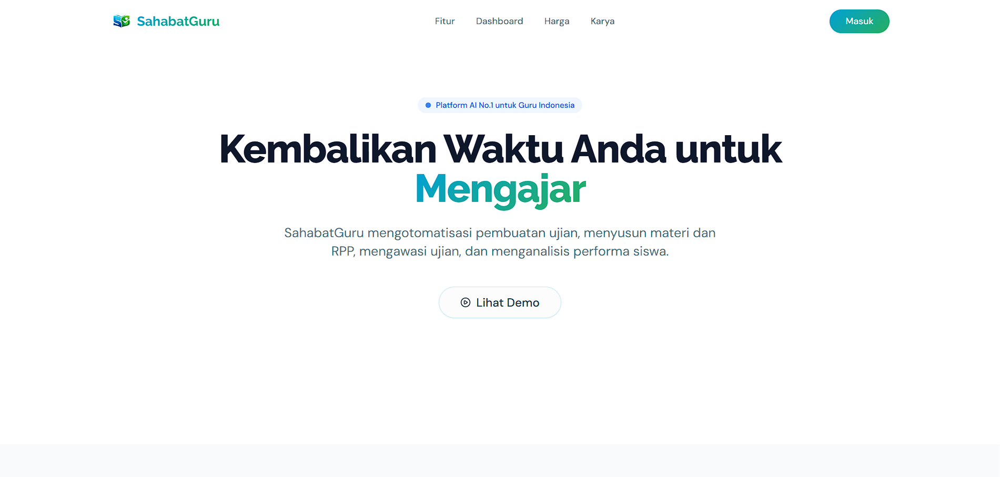

# SahabatGuru Frontend

https://sahabat-guru.vercel.app/



## Features
- **AI Material Generation**
- **Cheating Detection**
- **Interactive Exams**
- **Role-based Access**

## Tech Stack
- **Framework**: Next.js 14
- **Styling**: Tailwind CSS

## Setup
```bash
npm install
```

## Development
To start the development server:
```bash
npm run dev
```

The application will be available at `http://localhost:3000`.
